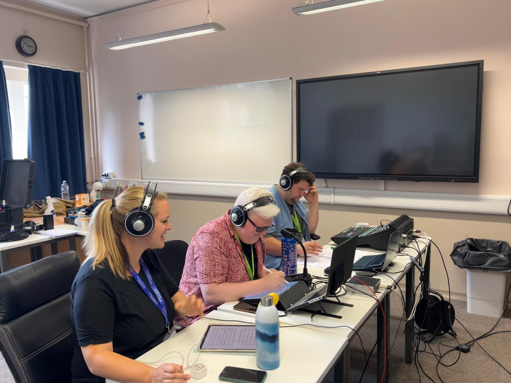
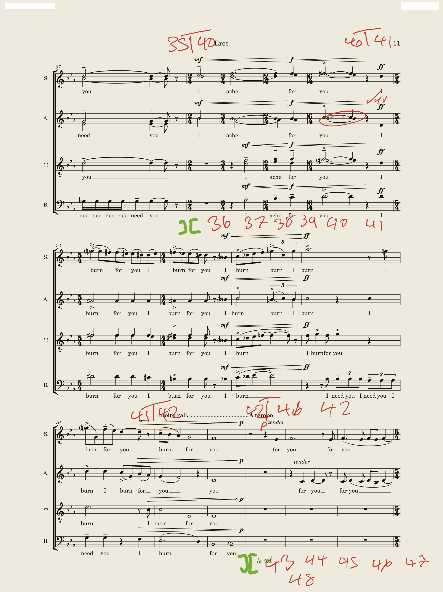
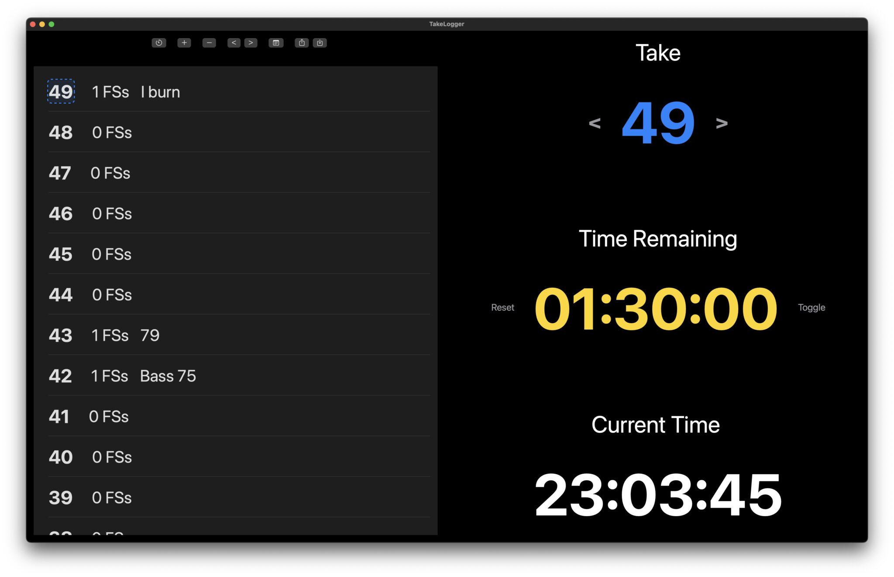
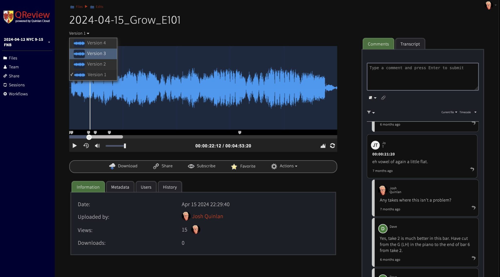

I’ve always found it fascinating to see what tools, processes and technologies other producers and recording engineers use to facilitate the recording process. There are of course many producers that still use a pencil and paper to write their take logs and annotate scores, and many engineers will loudly proclaim that their chosen DAW is ‘the best’. I’m not here to disagree with those people - after all, the most important thing is that everyone develops a system that works for them; however, I think we owe it to ourselves and our clients to always develop, optimise and improve our processes to increase our efficiency and make the experience for the artists as stress-free as possible.

For those that don’t necessarily care about the justification behind what tools I use and how I came to use them, I’ve included a summary at the bottom of the article.

---

## Challenges

When designing my workflow, there were a number of key things that I was looking to achieve and an array of challenges that I wanted to overcome. These are certainly not unique to me, however there are a few things that are specific to my situation that complicated matters somewhat.

The main challenge I’ve got is that I’m registered blind, so using hard copies of scores is particularly impossible for me – the font is too small to read, and using magnifiers and other LVAs (low vision aids) simply isn’t sufficient. Many years ago, the solution would have been to enlarge everything onto A3 paper, but given how much extra prep this would require (and how much paper it would use!), the solution seemed obvious – go digital…

I certainly wouldn’t be the first musician to use an iPad in sessions. Indeed, I myself have been using [forScore](https://forscore.co/) on an iPad since 2018, and it’s generally been a pretty solid experience. However, it’s not perfect.

* forScore is prone to crashing, particularly when viewing a particularly large score, or when annotating it whilst zoomed in. For obvious reasons, it cannot crash, otherwise that could interrupt the whole session. forScore has become a little more stable in recent years, but it’s still not perfect, and there are simply no other apps that come anywhere even close in terms of functionality.
* Where do I write take logs? Whilst the iPad has good multitasking functionality, I wanted to reduce the number of applications running on this device to ensure maximum stability and so that the entire screen shows the score.
* If the engineer isn’t using [Pyramix](https://www.merging.com/products/pyramix) (or another system that displays the current take number), how can I keep track of what take I’m currently on, in addition to other key bits of information like how many False Starts there have been?

In addition to the problems raised above, I had a number of key objectives:

* Each part of my ‘system’ should work independently and be able to function apart from other components (i.e. the '[Unix philosophy](https://cscie2x.dce.harvard.edu/hw/ch01s06.html)').
* As much of my workflow should use open source software solutions as possible, avoiding proprietary software and vendor-locked SaaS solutions wherever possible. I knew that this wouldn’t be possible for everything (particularly in choosing DAWs), but using proprietary software should be a last resort.
* All components should be user-friendly and flexible so that they can fit the needs of any projects. Not all users (engineers, artists, stakeholders, etc.) will be advanced computer users, and the main priority is to make everyone’s lives easier, so the solution needs to, at the minimum, be as easy as the ‘established’ methods.
* As many components as possible should use standard file formats and be platform-agnostic such that it could be run from any device.
* At the review/approvals stage, there should be a clear audit trail showing who has reviewed what and when. This is primarily so I can be sure that the required sign-offs have been given and that there is clear evidence of this.
* E-mail should be avoided at all costs. Whilst I find e-mail fascinating and get a lot of enjoyment from maintaining my e-mail servers, it is not well-designed for this sort of process, so we should only fall back to using it when everything else is broken. I don’t want to have scroll back through a long e-mail thread with dozens of messages to realise that I’ve missed something, nor do I want my clients to have to do that – it’s tedious and a huge waste of time!

That’s a lot of requirements! Of course, it didn’t start out that long – I’ve kept adding things to it as I’ve worked on my ‘setup’, and this is by no means an exhaustive list – but these are the core objectives that I wanted to meet in designing my workflow, and I believe that I’ve now succeeded in meeting all of them.

For the rest of the article, I will work through my process in chronological order starting from pre-production planning and ending with delivery & completion.

## Solution

### Pre-Production

When a client books me to produce a session for them, the first details that I ascertain are:

1. When and where is the session?
1. Who is being recorded (ensemble, soloists, etc.)?
1. What is being recorded (repertoire)?
1. Who is on the production team (conductor(s), engineer(s), editor(s), etc.)?
1. What are the key deadlines that need to be met, and what stakeholders are involved (executives, labels, etc. – i.e. who’s going to want to hear it before it’s signed off, and when do they need to hear it by)?
1. Finances
1. Any other details that may be relevant

I store all of the above information (and much more) in my CRM - a heavily-customised deployment of the excellent open source CRM solution [EspoCRM](https://www.espocrm.com/). This system allows me to plan out projects in detail and see at a glance where everything is up to.

At this stage, I also create entries in my customised [InvoicePlane](https://invoiceplane.com/) instance, ready to send out quotes and invoices as required.

In addition to this, I coordinate with the client’s management and the production team to produce schedules, stage plans, rigging diagrams, etc. in advance of the session so there are no surprises. What’s involved with these varies wildly depending on the amount of music, size of the ensemble and what the client’s objectives are. 

Of course, how much work is required at the planning stage very much depends on the project. Sometimes I book production staff and studio space on the client’s behalf, which is obviously quite a lot more involved, and sometimes this is all already done and I just need to turn up on the day. Whatever happens, I know that when I turn up I have all the information I need to make the day a success.

All additional documents, including stage plans, schedules, etc., are stored in a folder devoted to the project within my Nextcloud instance, Athena. It’s just a self-hosted alternative to the likes of Google Drive, Dropbox, etc., but I personally much prefer it – not only do I have complete control over all the data on my server, but I can also extend Nextcloud with the features that I need through custom-developed Apps.

### Recording day

Generally, I run two different systems on recording day:
* a 12.9-inch iPad Pro
* an M1 Pro MacBook Pro (2021 model)

though the latter of these could really be anything – this just happens to be my primary machine at the moment.

I use the iPad to view the scores being recorded and make all of my annotations. Specifically, I use the [forScore](https://forscore.co/) app and an Apple Pencil Gen 2. Aside from the fact that I’m doing things digitally, everything else is relatively standard – I use T-notation for denoting patch choices and overdubs, scrawl where I need a mark to jog my memory, and note down where takes start/end beneath the stave. I might write a separate post in the future about my annotation system.

The below is an example page from a score recorded in October 2024 – they don’t all look this neat (if you can even call this neat!):

On my computer, I run a custom application called [TakeLogger](https://github.com/DonQuinleone/TakeLogger). It does what it says on the tin – it’s a take logger; that is, it lets me keep track of what take I’m currently on, how many false starts there have been, and any other notes that I’d like to record! It also has a countdown timer (telling me how long is left in the current session) and a clock (showing the current time), both there to ensure that I stick to time. I’m working on DAW integration at the moment so this kind of information can be captured automatically, but it does the job for now

Here’s the ‘take log’ from the same session that included the score above:

In addition to TakeLogger, I usually have the CRM open so I can view the list of artists for the session and any notes that I’ve taken. I would ordinarily place this on a secondary monitor so it’s always visible to me.

At the end of the session, a data exchange happens. If I’m editing, I’ll either take a copy of the session files or just the audio files on a portable SSD, or the engineer will send the files to me via Athena, WeTransfer or another similar solution. If I’m not editing, I upload the annotated scores and my take logs to Athena and send them to the editor.

### Editing

For this section, let’s assume that I’m the one editing. I won’t linger too much here because my workflow is largely the same as everyone else’s.

My DAW of choice is [MAGIX Sequoia](https://www.magix.com/us/music-editing/sequoia). Similar to other options like [Pyramix](https://www.merging.com/products/pyramix) and [SADiE](https://www.sadie.com/), the thing that makes Sequoia so powerful is Source-Destination Editing – a supercharged editing workflow that lets you compile complete edits effortlessly. The main concept is that you have two main areas – the Source (all of your raw takes), and the Destination (your compiled edit) – and you send your chosen takes from the Source area to the Destination area with a keyboard shortcut. This, in addition to other must-have features like ripple editing (an edit where all the surrounding content is adjusted automatically) and an extremely comprehensive crossfade editor, can cumulatively save hours of editing when putting together a larger project; importantly, it also negates the RSI that can be induced by the editing workflows in other programmes like [Pro Tools](https://www.avid.com/pro-tools) when working on a large classical project involving hundreds or thousands of edits!. Whenever I’m doing a classical project, Sequoia is my go-to, and never lets me down! Why I chose this over Pyramix and SADiE is a more interesting conversation, and perhaps for another time.

Having pointed out one of the flaws of Pro Tools, many people therefore wonder why Avid Pro Tools Studio is my second DAW of choice…

Put simply, it is by far the best option when recording anything to click and/or dealing with large channel counts. It’s stable, incredibly flexible and consistent across every installation, and it’s so prevalent in recording studios that I can turn up at any session and immediately know what’s going on. More specifically, the editing workflow when comping together an edit of a track that was recorded to click is utterly superb – completely intuitive and efficient once you’ve learnt the keyboard shortcuts. I also tend to stick to editing in Pro Tools when the session was recorded in Pro Tools; of course, I could copy all the files over to Sequoia, but I generally find that I’m a good way through the edit by the time that I would’ve finished setting up the Sequoia session, so I usually don’t bother.

In terms of plugins, I generally keep things quite minimal. My reverb of choice is [Valhalla Room](https://valhalladsp.com/shop/reverb/valhalla-room/) – an inexpensive but high quality option, in my opinion – and my go to equalizer and compressor are both by [FabFilter](https://www.fabfilter.com/) – Pro-Q 3 and Pro-C 2 respectively. Of course, [Melodyne](https://www.celemony.com/en/melodyne/what-is-melodyne) is a must-have now-a-days too, though I try to use it as little as possible. For de-noising, I use a combination of [iZotope RX](https://www.izotope.com/en/products/rx.html) and [Steinberg SpectraLayers](https://www.steinberg.net/spectralayers/) – they’re both great and I use each for different things, though the bulk of my time is spent in RX. Lastly, for DDP creation I tend to use [DSP-Quattro’s DSP-AudioCDBuilder](https://www.dsp-quattro.com/dspquattro/Site/dsp-audiocdbuilder-features.html), along with [MP3tag](https://www.mp3tag.de/en/) for BEXT chunk authoring and MP3 tagging.

I also like to be able to be hands-on when mixing sessions, so I use a [PreSonus FaderPort 16](https://uk.presonus.com/products/faderport-16-production-controller) to make life a bit easier. I don’t use it on every session, but when working on big projects, it can save lots of time, especially where lots of volume automation is needed. Other hardware includes an [SSL 2+](https://solidstatelogic.com/products/ssl2-plus) and a [Focusrite Scarlett 18i20 Gen 3](https://focusrite.com/products/scarlett-18i20-3rd-gen), along with assorted headphones (mostly from Beyerdynamic, Sony and Sennheiser), and I use both [Dante](https://www.getdante.com/) and [Rogue Amoeba’s Loopback](https://rogueamoeba.com/loopback/) for audio routing on the network and in-machine respectively.

Of course, a big part of the editing process is going out to stakeholders for their feedback, and that’s what we’ll discuss next.

### Collecting and acting on stakeholder feedback

One of the key things that I wanted to get right in my workflow was the experience for stakeholders, whether they’re conductors, performers, engineers, label reps or otherwise. The typical workflow that I’ve observed involves:

1. Editor completes the first edit
1. Editor sends the first edit to whoever needs to receive it via WeTransfer
1. Recipient responds to the editor via e-mail
1. Repeat ad infinitum
1. Circa 25 e-mails later (usually not in the same thread), stakeholders confirm that they’re all happy via e-mail and the editor sends the masters to the client via WeTransfer

Occasionally you’ll come across someone that uses a spreadsheet and Dropbox to make this process a little simpler, but that’s rare in my experience. Needless to say, this system is riddled with inefficiencies and opportunities for problems, so I thought I’d come up with something better.

This isn’t intended to be a critique of people that use WeTransfer, Dropbox or similar services, nor of anybody using the workflow mentioned above – I was doing this myself until Spring 2024, and they are great services! I’m merely trying to point out the problems of the above, and how we can get around them. The main problems that I observed are:

1. Reliance on third-party, often expensive, services that you have no control over.
1. Stakeholders need to download every version of the track
    * With particularly sensitive projects, it isn’t ideal that the track is being downloaded at all
    * It isn’t easy to compare between different versions
    * Unless you’re incredibly organised with file storage, it’s easy to get versions mixed up
1. It’s difficult to keep track of who has received the track, when it was opened (if it was at all), and whether it was shared any wider than intended
1. E-mails, or even spreadsheets, are not an ideal way to receive feedback. What if you want to respond to a particular comment, or other stakeholders want to? What if you want to mark particular comments as being done, or mark them as “won’t fix”? You can’t easily do either.
1. There is no centralised ‘source of truth’ that everyone can rely on, meaning that you have to dig back through e-mail threads to figure out what’s gone on.

When planning how I was going to resolve all of the above, there were two industries that I looked to for inspiration – film production and software development. Both industries have very clearly established production/development processes and technologies that can be used to support those processes. In software development, SCM (source control management, e.g. Git) and Agile/Scrum are used to organise tasks and keep track of who has down what and when, and in the film industry there are clear feedback/approval pipelines that need to be followed before any asset is delivered. Neither industry has a solution that perfectly fits our needs here, but both show how technology can be used to make collaborative projects like ours run more efficiently.

There are many proprietary / SaaS solutions available that could be used to automate our processes – for example, both [Frame.io](https://frame.io/) and [FileStage](https://filestage.io/) are excellent solutions, and would largely achieve what we’re looking for; however, these solutions are very expensive, are closed source, aren’t designed specifically for our use case, and most importantly come with the big problem that is **vendor lock-in**. I don’t want to be in the situation where a company goes bust and I lose all my data, nor do I want to be forced to pay more in the situation that a provider increases their prices. Furthermore, I greatly appreciate being able to self-host my solutions, giving me fine-grained control over how data is used, and allowing me to choose the hardware & software stack that the service is being run on. It would also be great if this solution could be open source, but that’s not a deal-breaker at this point – I don’t have the time to write something completely bespoke, and it’s unlikely that something open source exists that meets all my requirements.

As someone that’s been hosting my own solutions for many years, I’m not averse to interacting with and administering servers, whether they run on-premise or in the cloud. In this case, I chose to host this instance in the cloud since it would give me greater reliability, easy-expendability and much greater network performance.

So, I had decided that I wanted to self-host something, and that I wanted to run it in the cloud. Now I just needed to find the right application…

Introducing [Kollaborate](https://www.kollaborate.tv/) – a tool that is mostly designed for video projects, but works just as well for audio projects. When I stumbled across this solution, I immediately requested a trial license, spun up a server and got it installed. An hour or so later, **QReview** was born, and I haven’t looked back since.

QReview, my Kollaborate instance, is a fully-online review/approval system that addresses all of the problems raised above. It allows for engineers to securely upload new versions of tracks and for stakeholders to leave comments on & approve/reject new edits, all without the need to send a single e-mail. Feedback is marked with the timecode at which it was submitted, meaning that you can easily jump to the exact point in reference, and because versions of tracks are linked you can quickly compare the changes between versions. In addition to all of this, there are fine-grained permissions for both reviewers (that are accessing the track via a unique share link) and users (that have direct access to the system), meaning that I can define who can upload/download files, who can comment, who can read comments, and who can approve/reject versions. Plus, it works with audio, video and images, and even has support for complex encoding workflows on ingest (which I am currently experimenting with).

Here’s what the interface looks like:

This is the single most game-changing tool that I’ve implemented, and my clients and colleagues seem to love it almost as much as I do! It’s helped to make what has traditionally been quite a time-intensive, stressful process involving lots of back-and-forth over e-mail into something that can really be enjoyed. No, it’s not open source (which isn’t ideal), but it is at least hosted on my own servers, and I can access everything (files, database, metadata, etc.) over SSH/SFTP, so ultimately if I wanted to change to a different package I could and I wouldn’t lose anything.

And here’s the real kicker: I can do all of this for less than the cost of a Dropbox plan (after the initial cost of a Kollaborate license). That’s a win-win if you ask me…

## Summary

Getting to this point has been quite the journey and has involved lots of trial-and-error, but I’m delighted with the end result. It really works for me, and I feel that it really works for my clients too. Of course, I will never stop looking for ways to improve my processes and systems to make the experience even better, but I’m happy with where everything is at right now, which is a great position to be in.

Here’s a quick TL;DR of the technologies being used:

* DAWs of choice: **MAGIX Sequoia** (primary choice for classical recordings) and **Avid Pro Tools Studio** (for any recordings done to click or with high channel count)
* Score reading software: **forScore**
* Take logging software: **TakeLogger** (custom built open source application)
* Stakeholder review/approvals system: **QReview** (extended/customised version of **Kollaborate Server**)
* File storage: **Athena** (**Nextcloud** instance), with copies stored on a NAS for quick local access
* E-mail: **Hermes** (self-hosted, using **Postfix**, **Dovecot** and other open source components)
* CRM: Customised version of **EspoCRM**
* Billing/invoicing: **InvoicePlane**
* Computer systems: **MacBook Pro M1 Pro (2021)** (primary machine) and a custom-built machine dual-booting Windows and Arch Linux for running Sequoia & other specialist applications.

